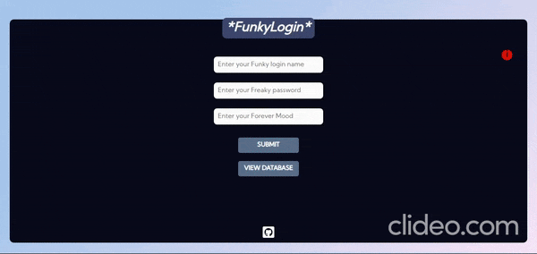

## FunkyLogin App :arrow_double_down:

### A simple login app that
* Accepts a user login name, password and current mood 
* Stores the details in a database
* Collects the latitude and longitude of the user and pinpoints the locations of the user on a map
* The stored database are also display in another page (cby clicking View database)

### Tech Stack  :computer:
#### FRONT-END - HTML | CSS | JAVASCRIPT 
#### BACKEND - NODE.JS(EXPRESS)
#### MAPPING - LEAFLET.JS, OPENSTREETMAP
#### DATABASE - NEDB

### Things that I have learned   :notebook_with_decorative_cover:
* Host a static webpage using express.js
* Use nedb, a lightweight database to store the login info of the user
* Understand in detail the differences between client side and server side rendering
* Use npm to install &  uninstall dependenices
* setting various request handlers(GET,POST)
* Created a RESTful API to fetch data from OpenStreetMap.
* How to use dotenv to store the accessToken / Secret keys in a key:value form. 

[LIVE DEMO](https://funkylogin.herokuapp.com)

